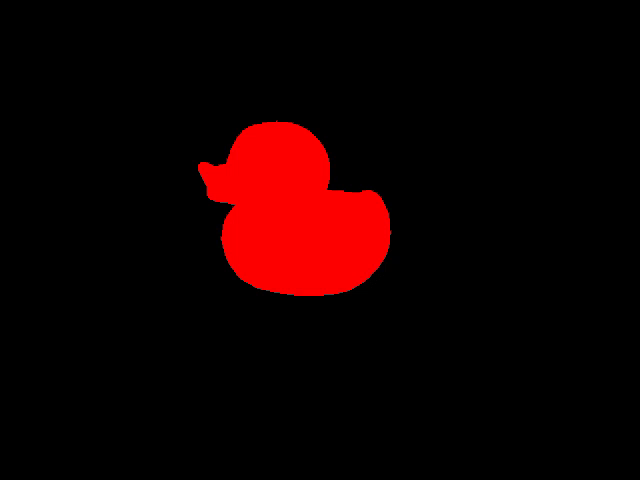
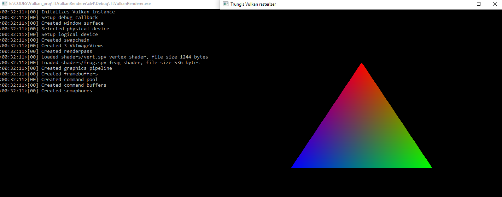

# TLVulkanRenderer
A simple Vulkan-based renderer for my [master thesis](https://docs.google.com/document/d/1YOAv2D23j74bExjP2MCMmDOQPquy9ywhBTW-tgU2QXA/edit?usp=sharing) on real-time transparency.

The renderer will be a rasterizer the implements [phenomenological transparency](http://graphics.cs.williams.edu/papers/TransparencyI3D16/McGuire2016Transparency.pdf) to demonstrate how the GPU could map well to this algorithm for real-time transparency.

This project also documents my learning progress with Vulkan and GPU programming.

# Update Oct 21, 2016

[Duck](TLVulkanRenderer/scenes/Duck) gltf loading (partially complete)! Right now I was able to load the index data and vertex data. I'm working on merging all the vertex buffers required for position, normal, texcoord attributes, indices, and uniforms, into a single buffer or memory allocation as recommended in the [Vulkan Memory Management](https://developer.nvidia.com/vulkan-memory-management) blog by Chris Hebert (@chrisjebert1973) and Christoph Kubischhttps://github.com/chrisjebert1973
https://github.com/chrisjebert1973

# Update Oct 14, 2016

Finished base rasterizer code to render a triangle.

### Requirements

- Build using x64 Visual Studio 2015 on Windows with a [Vulkan](https://www.khronos.org/vulkan/) support graphics card (Most discrete GPU in the last couple years should have Vulkan support). You can also check [NVIDIA support](https://developer.nvidia.com/vulkan-driver).
- [glfw 3.2.1](http://www.glfw.org/)
- [glm](http://glm.g-truc.net/0.9.8/index.html) library by [G-Truc Creation](http://www.g-truc.net/)
- [VulkanSDK](https://lunarg.com/vulkan-sdk/) by [LunarG](https://vulkan.lunarg.com/)
- Addthe following paths in Visual Studio project settings (for All Configurations):
 - C/C++ -> General -> Additional Include Directories:
    - `PATH_TO_PROJECT\TLVulkanRenderer\thirdparty`
    - `PATH_TO_GLFW\glfw\include`
    - `PATH_TO_VULKAN_SDK\VulkanSDK\1.0.26.0\Include`
    - `PATH_TO_GLM\glm`
 - Linker -> General -> Additional Library Directories:
    - `PATH_TO_VULKAN_SDK\VulkanSDK\1.0.26.0\Bin`
    - `PATH_TO_GLM\glfw-3.2.1.bin.WIN64\lib-vc2015`
 - Linker -> Input -> Additional Dependencies:
    - `vulkan-1.lib`
    - `glfw3.lib`

### Attributions

Majority of this application was modified from:
  - [Vulkan Tutorial](https://vulkan-tutorial.com/) by Alexander Overvoorde. [Github](https://github.com/Overv/VulkanTutorial). 
  - WSI Tutorial by Chris Hebert
  - [Vulkan Samples](https://github.com/SaschaWillems/Vulkan) by Sascha Willems

### Third party
 - [tinygltfloader](https://github.com/syoyo/tinygltfloader) by [syoyo](https://github.com/syoyo/)
 - [spdlog](https://github.com/gabime/spdlog) by [gabime](https://github.com/gabime/) (see LICENSE for details on LICENSE)

### References
  - [Vulkan Whitepaper](https://www.kdab.com/wp-content/uploads/stories/KDAB-whitepaper-Vulkan-2016-01-v4.pdf)
  - [Vulkan 1.0.28 - A Specification](https://www.khronos.org/registry/vulkan/specs/1.0-wsi_extensions/pdf/vkspec.pdf)

