# TLVulkanRenderer
A simple Vulkan-based renderer for my [master thesis](https://docs.google.com/document/d/1YOAv2D23j74bExjP2MCMmDOQPquy9ywhBTW-tgU2QXA/edit?usp=sharing) on real-time transparency under the advise of [Patrick Cozzi](http://www.seas.upenn.edu/~pcozzi/).

The renderer will be a rasterizer the implements [phenomenological transparency](http://graphics.cs.williams.edu/papers/TransparencyI3D16/McGuire2016Transparency.pdf) by [Morgan McGuire](http://cs.williams.edu/~morgan/) to demonstrate how the GPU could map well to this algorithm for real-time transparency.

This README also documents my learning progress with Vulkan and GPU programming.

# Releases

- **[v1.1](https://github.com/trungtle/TLVulkanRenderer/releases/tag/v1.1)**, _11/30/2016_
- **[v1.0](https://github.com/trungtle/TLVulkanRenderer/releases/tag/v1.0)**, _10/30/2016_

# Updates

### March 20 - New memory scheme for SBVH


I rewrote the SBVH memory scheme based on [Parallel Spatial Splits in Bounding Volume Hierarchies  ](http://rapt.technology/data/pssbvh.pdf). 

SBVH construction requires temporary memory to store fragments (from triangle split) and primitive references (full triangle) created during splitting. Previously, the memory was packed tightly inside an array and shuffled to partition the references into left and right sides of the split. However, this has created complication with additinal fragments due to triangle splits where child nodes can have larger memory than parent nodes. So before construction starts, I allocate an additional 20% memory of buffer space for the potential fragments. The availabe buffer space is assigned to the function stack in each recursive calls using the first and last pointers. During the partitioning phase, the fragments of the left and right child sets are aligned to the upper and lower boundary and grow toward the center. Free space is reserved in between. Then I recursively distribute the fragments again based on this scheme, applying to both spatial and object splits, until a leaf node is create. Once no free memory is available, the construction switches to using full object splits. 

The advantage of this division scheme is that the application can determine ahead of time how much memory to allocate, and each local task has full access to all its available memory without affecting other tasks. For potential parallel SBVH construction, this is extremely beneficial for lock-free multithreading since tasks don't need memory sychronization.


#### _The number on the right represents hiearchy levels. At each subdivision, the sets are then aligned to the upper and lower boundary of the buffer space and grow towards the center_

To simplify implementation, I use a `PrimInfo` struct to also mean a fragment reference. This does not necessarily mean that a primitive is duplicated, it's just that two or more nodes can point to the same primitive.
```
struct PrimInfo {
    PrimID primitiveID;
    BBox bbox;
}
```

The `PrimInfo` is then used to construct leaf nodes when splitting is no longer beneficial.

Some scenes can potentially generate a deep tree, so I limit the amount of spatial splits based on a split budget. It is a counter that decrements each time a spatial split happens. Once the budget is fully consumed, the construction switches to using full object splits.

In some performance tests, SBVH can save up to 20-30ms of traversal time, with the cost of increased memory. However, not all scenes benefit from SBVH, although SBVH never performs less than BVH. By tweaking the spatial split budget and limiting tree depth, I observed that performance is significantly affected. There seems to be an optimal threshold for the budget and the tree depth, so I will need to do some additional tests.

Other misc. tasks:
- Texture mapping
- Added tangent & bitangent for triangle, sphere, square plane, cube
- Material class interface, with metal, glass, Lambert materials
- Fixed gltf loader for multiple meshes
- Fake skybox using a gradient

### Plan

Since the infrastructure has diverged quite a bit from my codes for hybrid rendering, I'm working on re-porting that codes into this repo. With hybrid, I will only need to trace secondary rays for refractive & reflective materials. With shadow rays, I'm thinking of voxelizing the space, then store lighting information for each voxel to speed up shadow computation. However, it doesn't seem to be a big bottleneck at this point yet.


### Feb 26, 2017 - More SBVH fixes

This is a fairly short update. I spent most of the time fixing several bugs from building the SBVH. 

I have added a concept of "sub geometry", as in a geometry info struct that contains a bounding box for only part of the geometry, due to spatial split. They are stored together with the regular geometry info struct.

- Modified the SBVH leaf node to contain an array of geometry IDs instead of using the `firstGeomOffset` and `numGeoms` when querying geometries from a leaf node. The reason is because the same geometry can be included in two spatially split node, so we simply can't assume that each leaf node stores a unique geometry anymore.
- Modified the SBVH leaf node to contain a flag indicating whether it's a sub geometry. 
- Fixed a bug with BBox ray-intersection, which culled geometries when it shouldn't be.
- Fixed a bug with new sub bounding boxes created for sub geometries never updated their centroids, causing incorrect partitioning along the centroids.
- Fixed a bug with new sub geometry infos being inserted in the current geometry info list at a wrong location, shifting all other geometry infos back and out of order
- Fixed a bug where straddling geometries were being removed from the list
- Fixed a bug with computing sub bounding boxes for each bin during spatial split
- Fixed a bug with incorrect surface areas used in computing spatial split candidate cost.
- Added a couple test scenes.

### Plan

A couple of issues:
- The SBVH happens to run into stack overflow for a larger scene with thousands of geometries, so there's still work to do here. I'm going to focus on this next.
- Also, SBVH is expected to contain more nodes than BVH, but in some test scenes, my implementation of SBVH contains fewer nodes than a BVH. In some cases, the number of nodes was 33 vs. 97 for SBVH and BVH, respectively. This seems strange, so I need to look into this to understand why.

With GDC and interviews coming up, I might be limitted in time to get some work in next week, but will likely to resume progress the week after.

### Feb 19, 2017 - SBVH debugging, profiling, and code clean up

#### Ray traversal heat map

To determine the cost of traversing my SBVH, I appended to the `Ray` object a traversal cost. When ray tracing through the scene, each time the ray enters a node, its cost is increased by **0.25** for just entering the node, and by **1.0** for each ray-primitive intersection test inside the leaf node. The total cost is then used to color the scene with more red is equivalent to higher cost, and green means low cost.

I mocked up a simple test scene in Maya, with 456 primnitives. 

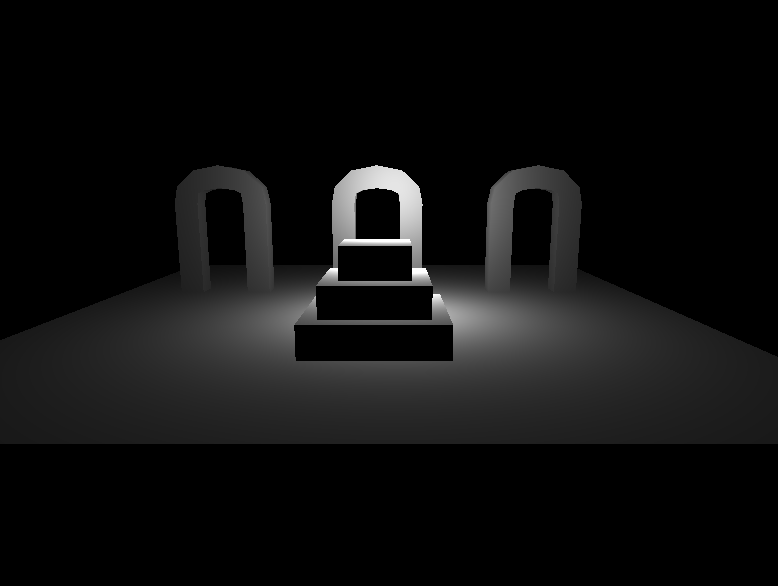

For each BVH implementation, the following renders show the ray traversal heat map for each splitting method:

| Equal counts | SAH | SBVH |
|---|---|---|
|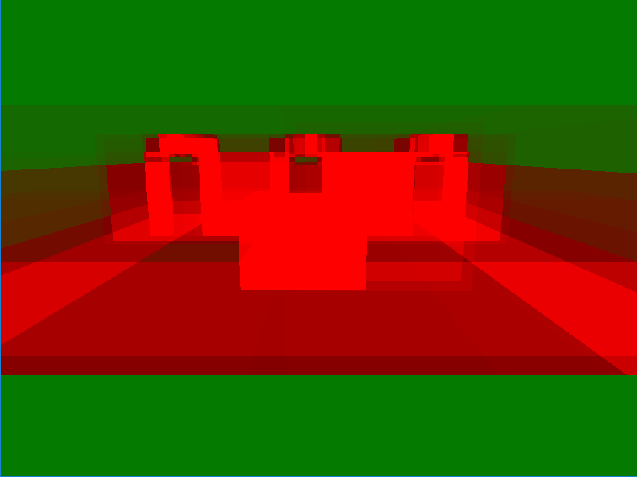|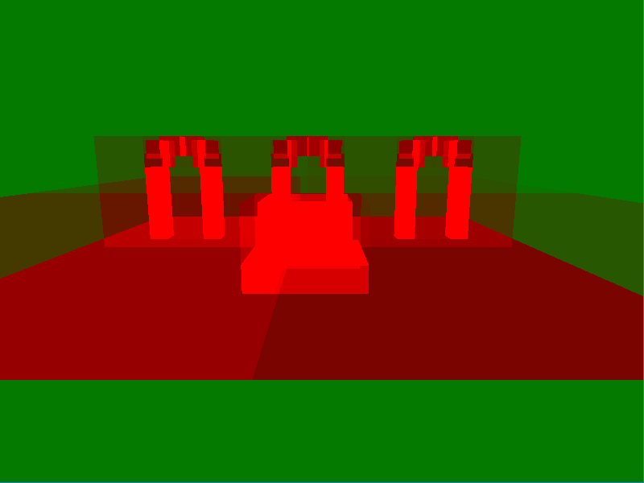|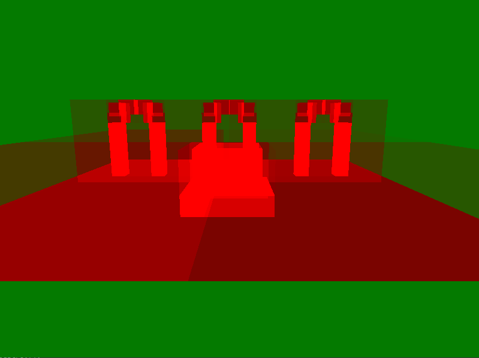|

One neat thing we can see now is that `SAH` and `SBVH` are superior to `EqualCounts`. This visualization, however, led me to believe that there is **DEFINITELY** a bug somewhere in my code. The spatial split (3rd column) should have shown a different heat map. There must be something wrong.

So to dig futher, I put together two additional scenes from Maya to test spatial splitting (whether it did occur at the splitting plane or not). To enforce spatial splitting, I simply ignore computing the cost for object split.

a) **Triangles**

This scene contains solely triangles, built into quads. Each triangle primitive should be subdivided if a spatial split occurs. 

| Diffuse | Heat map |
|---|---|
|||

b) **Cuboid**

This scene is a highly subdivided cuboid shape, with random faces extruded for visibility. With a high density of such a geometry when triangulated, I suspect that I should be able to see even clearer spatial splitting.

| Diffuse | Heat map |
|---|---|
|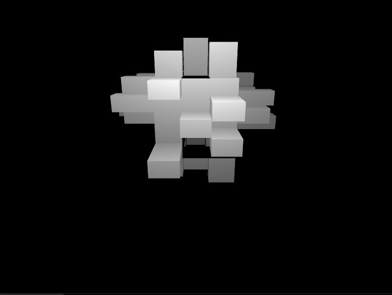|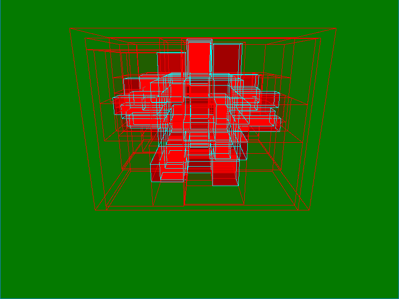|

By visual inspection, I could see that the spatial split **DID NOT** occur along the maximum extent for primitives that straddle multiple splitting planes. This confirmed to me that I should re-examined my code. In conclusion, there is a bug that new bounding boxes created by these spatial splits are currently not inserted at the right position, and that I did not take care of growing the bounding box list properly. For this week, I haven't had enough time to fix this error, so it is going to be in the next week's planning!

#### Misc. work

- In preparation for more robust scenes, I also cleaned up the scene loader for glTF (hoping for glTF 2.0).
- Added `VulkanHybridRenderer` boilerplate. Prepping for porting the hybrid renderer from my school project in GPU Programming.
- Cleaned up `SBVH` and `AccelStructure` interfaces to allow future extensions.
- Updated VulkanSDK from 1.0.33 to 1.0.39.1 (latest as of Feb 19, 2017). We're back to the modern day!
- Configured the graphics lab machine at Penn so that I can work from the lab now. Faster machines, and also easier to demo the project.

#### Plan

- Fixed the bug with new bounding boxes created from spatial splitting not inserted correctly into the SBVH tree.
- Start prepping for porting hybrind rendering over to be used with SBVH.
- I also would prefer having better GUI to quickly toggle on/off SBVH and switching between different modes. 

### Feb 12, 2017 - SBVH

This week, I implemented the full [SBVH (spatial splitting)](http://www.nvidia.com/docs/IO/77714/sbvh.pdf) for accelerating ray tracing. The structure follows this algorithm:

```
BuildNode :=
	divide node by 12 buckets along the maximum extend of the current node's AABB	
	// Each side of the bucket is considered a splitting plane

	// 1. Compute all object split candidates at each splitting plane
	for each reference in node
		find which bucket the reference's centroid is in, then put it there
		grow bucket's AABB by the reference's AABB

	for each bucket
		compute cost of splitting node based on SAH, and store the cheapest cost
		// objectSplitCost = cost_traversal + cost_intersection * num_ref_child1 * SA(child1) / SA(node) + cost_intersectino * num_ref_child2 * SA(child2) / SA(node)

	// Restricting spatial split if it doesn't benefit us 
	if SA(child1 overlapping child2) / SA(node) > alpha: skip steps 2 

	// 2. Compute spatial split candidate
	for each reference in node
		for each bucket the reference straddles
			// Finding clipped AABB is done by finding the splitting's plane,
			// then using similar triangles to compute the intersection points on the plane
			// The clipped AABB is then a union of the intersection points and the triangle vertices inside the bucket
			compute the smallest bounding box of reference clipped by bucket's boundaries
			
			grow bucket with this clipped bounding box
			
			// For retrieving the clipped reference
			insert new clipped AABB into geometry's info list

	for each bucket
		compute cost of splitting node based on SAH, and store the cheapest cost
		// spatialSplitCost = cost_traversal + cost_intersection * num_ref_child1 * SA(child1) / SA(node) + cost_intersectino * num_ref_child2 * SA(child2) / SA(node)

	// 3. Compare cost of object split candidate and spatial split candidate
	
	// 4. If split cost is cheaper than cost of making leaf node, then split, otherwise, create leaf node
```

There is a step referenced in the [paper](http://www.nvidia.com/docs/IO/77714/sbvh.pdf) about unsplitting references, but I haven't had yet a chance to implement it.

When testing SBVH versus just regular BVH with the following scene: 

| | |
|---|---|
| Scene ||
| # Primitives | 4212 | 
| # frames     | 300  | 

the result is roughly similar to full BVH:

|  | No spatial split | With spatial split |
| --- | --- | --- |
| ms / frame   | 130.33 | 127.26 |

It could be that this isn't the right scene to benefit from spatial split, or something is incorrect in my implementation. I'm going to test around with a couple different scenes also.

#### Bug

I tested with a large mesh, and seemed to have a bug either with the visual debugging, or with storing primitives inside leaf node. In the scene below, half of all the leaf nodes disappeared!

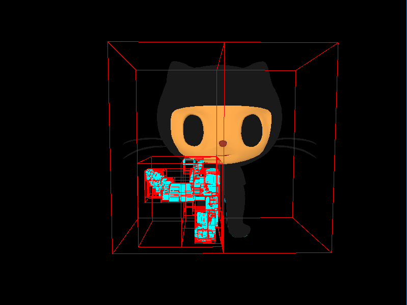

#### Plan

- Play some more with other scenes
- Implement unsplitting references for cases that spatial split doesn't outweight object split
- Fixing the bug mentioned above. Also, I would like to have some way to visualize that the spatial split works properly.
- Moving this code into GPU ray tracing? That's a thought, but it might seems to be a lot of work

### Feb 4, 2017 - SAH for BVH and uniform SSAA

#### SAH for BVH

Previously, the BVH only supported splitting using the `EqualCounts` method. This method partition evenly the number of geometries for each child node of a BVH interior node. While simple to implement and easy to understand, `EqualCounts` isn't the most efficient way to construct BVH tree. So this week I implemented the Surface Area Heuristics method, or `SAH`. Ray tracing speed is constrained by the cost of ray-triangle intersection, so the more we can skip irrelevant triangles, the better. `SAH` uses the surface area of primitive's bounding box to compute to probability the ray can intersect that bounding box, and decide whether to split a BVH node at that point, or generate a leaf node. We can think of the cost of splitting a node along a plane as:

`TotalCost = C_t + C_i * numTrisA * Area(childA) / Area(parent) + C_i * numTrisB * Area(childB) / Area(parent)`, where

* C_t: cost of traversal. The assumption here is that C_t = C_i / 8 (based on pbrt)
* C_i: cost of ray-triangle intersection
* numTrisA: number of triangles in child node A
* numTrisB: number of triangles in child node B

Based on the implementation in pbrt book, I first divided the splitting plane into 12 buckets to minimize searching for all possible splitting points. The buckets look like this:


The for each bucket, I computed the cost of splitting plane versus the cost of ray-triangle intersections for all primitives in that node. If the cost of doing the intersection test is cheaper, the turn this node into a leaf node instead, otherwise, split the node in half along the minimal cost bucket's centroid.

The result of SAH does in fact increased the speed of tree traversal. For the following test scene of the glTF duck:

| Equal counts | SAH |
|---|---|
|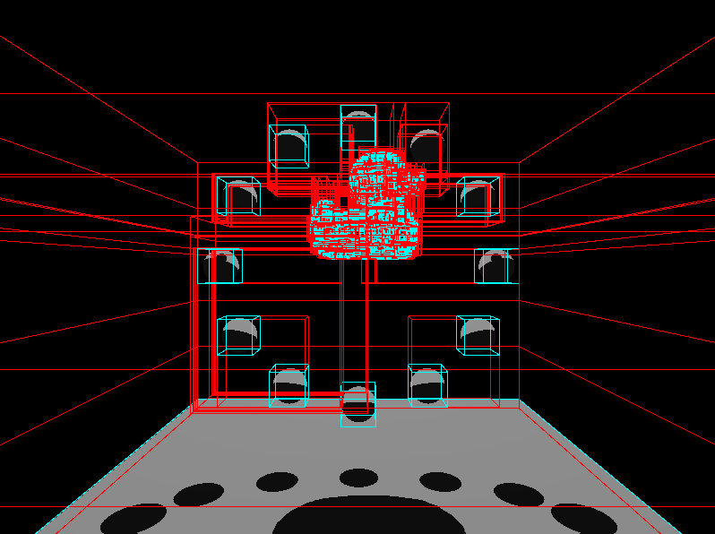||

the result is:

|  | Equal counts | SAH |
| --- | --- | --- |
| # Primitives | 4212 | 4212 |
| # BVH nodes  | 8449 | 8447 |
| # frames     | 300  | 300  |
| ms / frame   | 193.04 | 130.33 |

This confirms to me that in fact using `SAH` splitting method is an improvemance from using `EqualCounts` method. With the duck scene, the application was running 8-12 FPS. While a bit slow, this is a lot faster than my GPU ray tracing implementation.

#### Uniform SSAA

The ray tracer takes in a `Sampler` class that generate samples based on the pixel coordinates. For now, there is only one derived `UniformSampler`that generates X4, X8, and X6 samples. Running a SSAA sampler does reduce the performance of the ray tracer significantly. In the future, likely this will be swapped out for MSAA or TXAA to improve speed.

| No SSAA | SSAA X16 |
|---|---|
|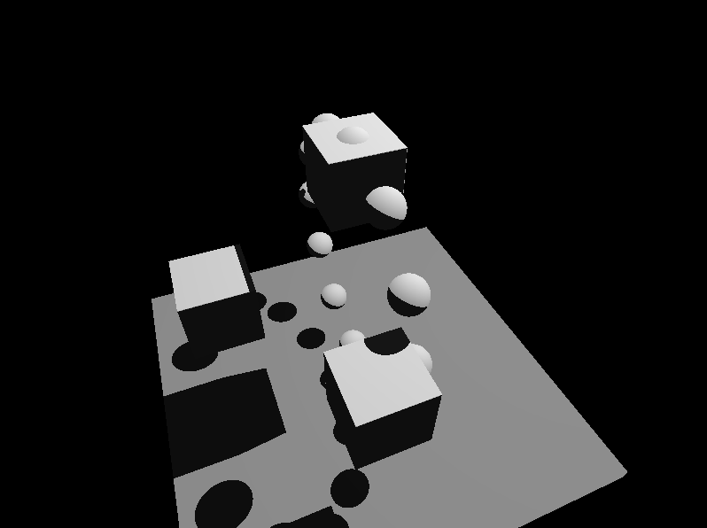||


#### Plan

To fully finish the acceleration structure, I still need to add spatial splitting to the BVH structure. The idea of an SBVH is to compare the cost of object splitting, the cost of spatial splitting, and the cost of generating a new leaf. This spatial splitting is similar to kd-tree, so I need to review again how kd-tree is implemented.

I also have mentioned using a queue of rays for multhreading tasks. With the queue implemented, free threads would be able to perform work instead of sitting idle. Going to also take a look of that next.

### Jan 30, 2017 - CPU ray tracer with BVH and multithreading

#### Multithreading

For this update, the CPU ray tracer now has added multithreading (using C++11 `std::thread`). Each render call will now launch up to 16 threads if available and ray trace for a 4x4 tiled image. 

For next week, I'm going to experiment with having the main thread render the next frame while the other worker threads ray trace. Addditionally, each generated ray should be put on a shared queue that each thread can pick up as soon as it has done its job instead of just sitting and waiting for all threads to join. Given the complexity differences for each pixel traced, this can give us the benefit of balancing out work load between each thread.

#### BVH

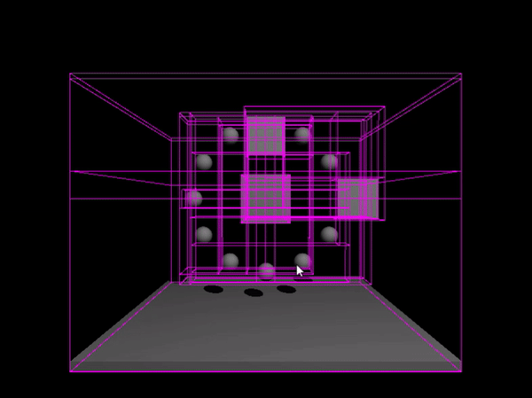

I also added a basic BVH structure to the scene. Since SBVH and BVH shares a similar structure and only differs in its construction phase, I opted to build and verified working for the normal BVH first before moving on to SBVH. The BVH currently splits along the maximum extent of the bounding box and not using SAH.

Each leaf node can contains up to several primitives. Here, the image shows a maximum 3 primitives per leaf node. 

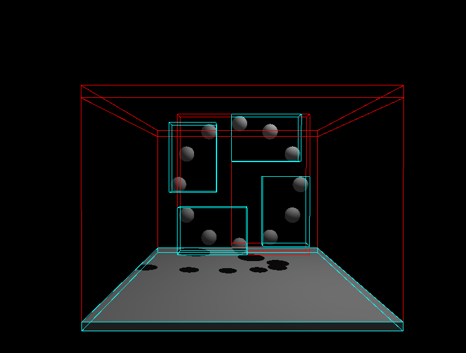

_The leaf nodes are colored in teal, where other intermediate nodes are colored in red_

### Jan 24, 2017 - Preparation for CPU ray tracing

Just small clean up to preparing for CPU ray tracing. I have split my previous implementation of ray tracing to be call VulkanGPURaytracer, versus this new renderer called VulkanCPURaytracer. Right now the renderer just load a texture a display it directly on the screen. Next step is to implement camera ray generation and ray intersection with sphere. 

### Nov 30, 2016 - Release v1.1: Optional raytracing mode, and a large software overhaul

Recently I had the time to develop a Vulkan raytracer as part of the GPU programming course's final project on a [hybrid ray-raster](https://github.com/davidgrosman/FinalProject-HybridRenderer/blob/master/docs/FinalProjectPitch.md) under [Patrick Cozzi](http://www.seas.upenn.edu/~pcozzi/). As part of that work, I had more opportunities to better architect the code base and I like it enough that I decided to migrate some of that work over to current thesis repo (this explains the new optional raytracing mode that wasn't part of the origin layout plan).

This release has several large improvements:

#### 1. Large code refactoring for Vulkan interface 
Specifically:

- Abstracted Vulkan devices, queues, and swapchain into its own class
- Added more Vulkan convenience methods to intialize and populate Vulkan structs with default values
- Added resource creation methods for `VkBuffer` and `VkImage` with automatic binding for `VkDeviceMemory`
- Separated graphics VkPipeline and compute `VkPipeline` workflow with prefixes "`PrepareGraphics_`" and "`PrepareCompute_`", respectively. 
- **Nice to have**: Previously, the `vulkan-1.lib` and `glfw3.lib` had to be linked externally. I have moved them inside the project for convenient new build. A new clone project should work out of the box now!

#### 2. Vulkan forward rasterizer

Complete Vulkan forward rasterizer as default renderer when the application starts.

#### 3. Optional Vulkan raytracing mode

To enable raytracing rendering mode, you'll have to change the rendering mode flag in [Application.h](https://github.com/trungtle/TLVulkanRenderer/blob/master/TLVulkanRenderer/src/Application.h) then rebuild the project.

`ERenderingMode renderindMode = ERenderingMode::FORWARD` to
`ERenderingMode renderindMode = ERenderingMode::RAYTRACING`

I'm planning on passing this as a command argument instead, but haven't had time to get around doing it yet.

Since my camera's position is initialized manually in code (should really be reading from glTF instead), the scene that works for raytracing mode is `scenes/gltfs/cornell/cornell.glb`. See [Quick start](https://github.com/trungtle/TLVulkanRenderer/blob/master/README.md#quickstart) below for instruction on how to pass in a glTF scene file as an argument.


This is a migration from my GPU Programming final project in CIS565, Penn. This Vulkan raytracing isn't performant and still a work in progress, but this allows for comparison between rasterizer and raytracer performance.

#### 4. Misc

- Better ms/frame measurement
- VS project filters for solution navigation
- Project wide code reformating for reading consistency

#### 5. New build

Away with the annoying absolute path configurations! This new release v1.1 now links all the dependencies into the same project so that a new clone can work out of the box. Do make sure you're using Visual Studion 2015 with target x64.

#### 6. Usage

Added a command line argument to specify glTF input file:

After build, the output executable will be in the build folder. Make sure to have your working directory at `TLVulkanRender/TLVulkanRender`, then for example, you can run:

```
 ./../build/Debug/VulkanRenderer.exe scenes/gltfs/duck/duck.gltf                              Default scene is glTF rubber duck
```

### Nov 4, 2016 - Memory & Depth Image

| Normal | Depth | Lambert |
|---|---|---|
||||

#### Memory management

In order to achieve cache ultilization and limit the amount of costly memory allocation, I packed the vertex indices and vertex attributes data for each mesh into the same `VkDeviceMemory` allocation and the same `VkBuffer`, and leaving the uniform buffer in its own `VkDeviceMemory` since it's being updated every frame. This helps reduce the initialization time to load each scene since we no longer have to create a new `VkBuffer` and allocate a new `VkDeviceMemoy` for each attribute.

Instead of directly map memory from the host, I create a temporary buffer for staging and transfer the data onto device memory this way.


In this layout scheme, we still need to partition based on each mesh data because when the meshes are extracted from glTF, each of them have their unique buffer view that needs to be handled properly. It seems to me that it's possible that we can just directly copy this glTF's buffer view into `VkDeviceMemory` and offset the `VkBuffer` correctly from there. It's also possibl to resuse the same `VkDeviceMemory` for different `VkBuffer`, but it seems quite error-prone to me to go down that path.  

More details can be found at [Vulkan Memory Management](https://developer.nvidia.com/vulkan-memory-management) from NVIDIA.

#### Depth buffer


The depth buffer in Vulkan is represented using a [`VkImage`](https://www.khronos.org/registry/vulkan/specs/1.0/xhtml/vkspec.html#resources-images). It's a type of resource that the framebuffer uses to store its data. Similarly to the [`VkImage`](https://www.khronos.org/registry/vulkan/specs/1.0/xhtml/vkspec.html#resources-images)s inside the swapchain, a depth image is just another attachment to the renderpass. However, depth image still has to be created as an additional resource that we need to manage. I allocated a screen size depth resource for populating the depth data in, and then attache the depth image to the renderpass's subpass (I only use one subpass). 

After that, the graphics pipeline creation needs to be modified to enable the depth and stentil stage by setting [VkPipelineDepthStencilStateCreateInfo](https://www.khronos.org/registry/vulkan/specs/1.0/xhtml/vkspec.html#VkPipelineDepthStencilStateCreateInfo) struct and set its pointer to the graphics pipeline.

### Oct 21, 2016 - This time is for glTF!

[Duck](TLVulkanRenderer/scenes/Duck) mesh in glTF format (partially complete, shading hasn't been implemented properly)! 

Right now I was able to load the index data and vertex data. I'm working on merging all the vertex buffers required for position, normal, texcoord attributes, indices, and uniforms, into a single buffer or memory allocation as recommended in the [Vulkan Memory Management](https://developer.nvidia.com/vulkan-memory-management) blog by Chris Hebert ([@chrisjebert1973](https://github.com/chrisjebert1973)) and Christoph Kubisch.

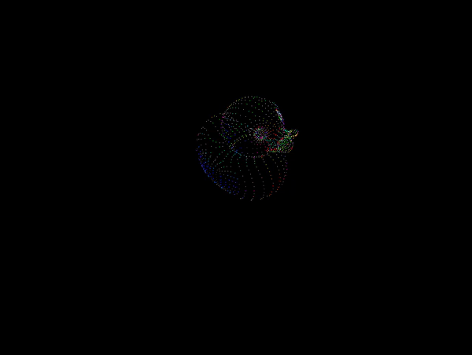

### Oct 14, 2016 - Triangles!

Finished base rasterizer code to render a triangle.


# Quickstart

### Build 

Build with Visual Studio 2015 on Windows and target x64. Your machine must support at least one [Vulkan](https://www.khronos.org/vulkan/)-capable graphics card (Most discrete GPU in the last couple years should have Vulkan support). You can also check [NVIDIA support](https://developer.nvidia.com/vulkan-driver). The project should run out of the box with a [duck](TLVulkanRenderer/scenes/Duck) default scene.


### Usage

From Visual Studio, you can pass in glTF scene as: 

```
Properties -> Debugging -> Command Arguments -> scenes/gltfs/duck/duck.gltf
```

Or from command prompt after `git clone`

```
cd TLVulkanRenderer/TLVulkanRenderer
 ./../build/Debug/VulkanRenderer.exe scenes/gltfs/duck/duck.gltf
```

# Known issues

Since my camera isn't initialized from glTF file but manually hard-coded, some scene might not work correctly.

# Third party

 - [tinygltfloader](https://github.com/syoyo/tinygltfloader) by [@soyoyo](https://github.com/syoyo)
 - [obj2gltf](https://github.com/AnalyticalGraphicsInc/OBJ2GLTF) by [AnalyticalGraphicsInc](https://github.com/AnalyticalGraphicsInc)
 - [spdlog](https://github.com/gabime/spdlog) by [gabime](https://github.com/gabime/) (see LICENSE for details on LICENSE)

# Vulkan References

Great credit goes to [Vulkan Tutorial](https://vulkan-tutorial.com/) by Alexander Overvoorde. [Github](https://github.com/Overv/VulkanTutorial) and [Vulkan Samples](https://github.com/SaschaWillems/Vulkan) by Sascha Willems. Additionally, I used references from:

  - WSI Tutorial by Chris Hebert
  - [Vulkan 1.0.28 - A Specification](https://www.khronos.org/registry/vulkan/specs/1.0-wsi_extensions/pdf/vkspec.pdf)
  - [Vulkan Whitepaper](https://www.kdab.com/wp-content/uploads/stories/KDAB-whitepaper-Vulkan-2016-01-v4.pdf)

 # Models

Listing of glTF models and scenes used in this project for testing and demos:

* [glTF Sample Models](https://github.com/KhronosGroup/glTF/blob/master/sampleModels/README.md)
* [octocat]() by [Sally Kong](https://sketchfab.com/models/cad2ffa5d8a24423ab246ee0916a7f3e). Model is converted using [obj2gltf](https://github.com/AnalyticalGraphicsInc/OBJ2GLTF).
* [wolf]() by [Rachel Hwang](https://www.linkedin.com/in/rachel-hwang-84a3b989). Model is converted using [obj2gltf](https://github.com/AnalyticalGraphicsInc/OBJ2GLTF).
* [centaur model](http://tf3dm.com/3d-model/free-base-mesh-centaur--67384.html) by [BAQStudio](http://tf3dm.com/user/baqstudio), Model is converted using [obj2gltf](https://github.com/AnalyticalGraphicsInc/OBJ2GLTF).
* Infinite, [3D Head Scan]() by Lee Perry-Smith is licensed under a Creative Commons Attribution 3.0 Unported License. Based on a work at www.triplegangers.com. This distribution was created by Morgan McGuire and Guedis Cardenas http://graphics.cs.williams.edu/data/. See [LICENSE](/gltfs/head/Infinite-Scan_License.txt). Model is converted using [obj2gltf](https://github.com/AnalyticalGraphicsInc/OBJ2GLTF).

